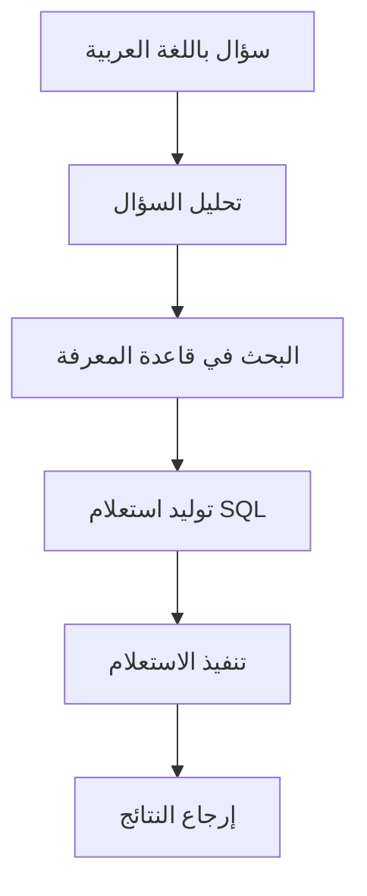

# دليل البداية - Vanna AI

**أداة ذكية مفتوحة المصدر لتحويل الأسئلة العربية إلى استعلامات SQL دقيقة**

---

## مقدمة عن Vanna AI

**Vanna AI** هو مشروع مفتوح المصدر مبني بلغة Python يستخدم تقنية **RAG (Retrieval-Augmented Generation)** لتحويل الأسئلة المكتوبة باللغة الطبيعية إلى استعلامات SQL دقيقة. تم تطوير هذه الأداة لتمكين المستخدمين غير التقنيين من الوصول إلى بيانات قواعد البيانات بسهولة ودون الحاجة لمعرفة عميقة بلغة SQL.

### معلومات أساسية

| المعلومة | القيمة |
|---------|--------|
| **الاسم** | Vanna AI |
| **النوع** | مكتبة Python مفتوحة المصدر |
| **الترخيص** | MIT License |
| **النجوم على GitHub** | 20,000+ نجمة |
| **الإصدار الحالي** | 0.7.9 |
| **اللغة** | Python 3.11+ |
| **المطور** | Vanna AI Team |

### كيف يعمل Vanna؟

يعمل Vanna في **خطوتين أساسيتين**:

#### 1. التدريب (Training)
تدريب نموذج RAG على بيانات قاعدة البيانات الخاصة بك:
- **هيكل الجداول (DDL)**: تعريفات الجداول والأعمدة والعلاقات
- **توثيق الأعمال**: المصطلحات والقواعد التجارية
- **أمثلة SQL**: استعلامات سابقة ناجحة

#### 2. الاستعلام (Querying)
طرح الأسئلة باللغة الطبيعية والحصول على استعلامات SQL:
- **تحليل السؤال**: فهم المطلوب من السؤال
- **البحث في البيانات المدربة**: العثور على المعلومات ذات الصلة
- **توليد استعلام SQL**: إنشاء استعلام مناسب
- **تنفيذ وإرجاع النتائج**: تشغيل الاستعلام وعرض البيانات

---

## المميزات والخصائص

### المميزات الرئيسية

#### 🌍 دعم متعدد اللغات
- **دعم ممتاز للغة العربية**: يفهم الأسئلة المعقدة باللغة العربية
- **فهم المصطلحات المحلية**: يتعامل مع المصطلحات التجارية السعودية
- **ترجمة دقيقة**: تحويل المفاهيم العربية إلى استعلامات SQL صحيحة

#### 🗄️ دعم قواعد بيانات متعددة
- **PostgreSQL**: قاعدة البيانات الأكثر تقدماً
- **MySQL**: الأكثر شيوعاً في التطبيقات
- **SQLite**: مثالية للاختبار والتطوير
- **Microsoft SQL Server**: للبيئات المؤسسية
- **Snowflake**: لمستودعات البيانات السحابية
- **BigQuery**: لتحليل البيانات الضخمة

#### 🤖 دعم نماذج الذكاء الاصطناعي المتعددة
- **OpenAI GPT-4**: أعلى جودة
- **OpenAI GPT-3.5**: جودة عالية بتكلفة أقل
- **Claude**: جودة ممتازة
- **Gemini**: جودة عالية من Google
- **Ollama**: مجاني ومفتوح المصدر
- **HuggingFace**: نماذج محلية مجانية

#### 🖥️ واجهات مستخدم متعددة
- **Jupyter Notebook**: للتطوير والاختبار
- **Streamlit**: واجهة ويب تفاعلية
- **Flask**: تطبيق ويب مخصص
- **Slack Bot**: للتكامل مع فرق العمل

### الخصائص التقنية

#### 🔒 الأمان
- **حماية البيانات**: محتويات قاعدة البيانات لا تُرسل للـ LLM
- **معالجة محلية**: البيانات الحساسة تُعالج محلياً
- **تشفير الاتصالات**: جميع الاتصالات مشفرة
- **تشغيل محلي**: إمكانية التشغيل بالكامل دون إنترنت

#### ⚡ الأداء
- **سرعة الاستجابة**: متوسط 1-2 ثانية
- **دعم الاستعلامات المعقدة**: يتعامل مع JOINs متعددة
- **تحسين مستمر**: يتعلم من الاستخدام
- **ذاكرة تخزين مؤقت**: للاستعلامات الشائعة

---

## متطلبات النظام

### متطلبات أساسية

| المتطلب | الحد الأدنى | المُوصى به |
|---------|------------|-------------|
| **Python** | 3.11+ | 3.11+ |
| **نظام التشغيل** | Windows 10, macOS 10.15, Ubuntu 20.04 | أحدث الإصدارات |
| **الذاكرة (RAM)** | 4 GB | 8 GB |
| **مساحة القرص** | 2 GB | 5 GB |
| **الإنترنت** | مطلوب للنماذج السحابية | سرعة عالية |

### متطلبات اختيارية
- **GPU**: لتسريع النماذج المحلية (CUDA compatible)
- **Docker**: لنشر التطبيقات
- **Git**: لتحميل أحدث الإصدارات

---

## الخطوات التالية

بعد فهم الأساسيات، يمكنك الانتقال إلى:

1. **[التنصيب والإعداد](./installation.md)** - تعلم كيفية تثبيت Vanna AI
2. **[الاستخدام الأساسي](./basic-usage.md)** - تعلم كيفية استخدام الأداة
3. **[أمثلة عملية](./testing.md)** - شاهد أمثلة حقيقية للاستخدام

---

**ابدأ رحلتك مع Vanna AI اليوم! ��**

