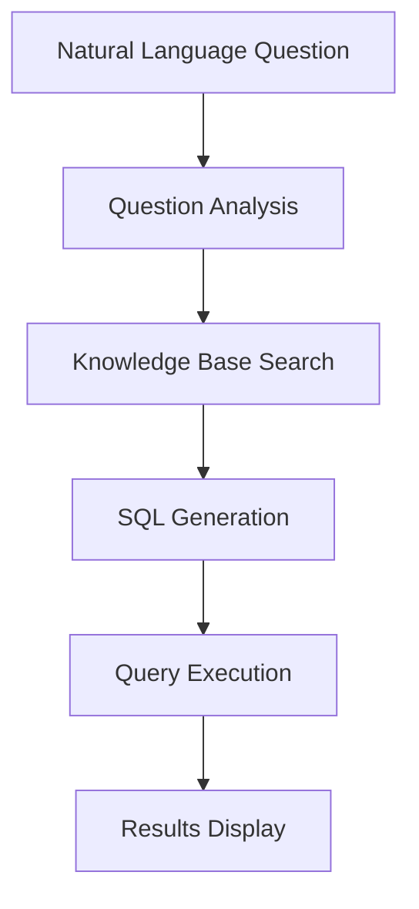

# Getting Started with Vanna AI

**Intelligent Open-Source Tool for Converting Natural Language to SQL Queries**

---

## What is Vanna AI?

**Vanna AI** is an open-source Python project that uses **RAG (Retrieval-Augmented Generation)** technology to convert natural language questions into accurate SQL queries. This tool was developed to enable non-technical users to access database data easily without needing deep SQL knowledge.

### Basic Information

| Information | Value |
|-------------|-------|
| **Name** | Vanna AI |
| **Type** | Open-source Python library |
| **License** | MIT License |
| **GitHub Stars** | 20,000+ stars |
| **Current Version** | 0.7.9 |
| **Language** | Python 3.11+ |
| **Developer** | Vanna AI Team |

### How Does Vanna Work?

Vanna works in **two main steps**:

#### 1. Training Phase
Training the RAG model on your database data:
- **Table Structure (DDL)**: Table definitions, columns, and relationships
- **Business Documentation**: Business terminology and rules
- **SQL Examples**: Previous successful queries

#### 2. Query Phase
Asking questions in natural language and getting SQL queries:
- **Question Analysis**: Understanding what's being asked
- **Search in Trained Data**: Finding relevant information
- **SQL Generation**: Creating appropriate queries
- **Execution and Results**: Running queries and displaying data

---

## Features and Characteristics

### Main Features

#### 🌍 Multi-language Support
- **Excellent Arabic Support**: Understands complex Arabic questions
- **Local Terminology Understanding**: Handles Saudi business terminology
- **Accurate Translation**: Converts Arabic concepts to correct SQL queries

#### 🗄️ Multi-database Support
- **PostgreSQL**: Most advanced database
- **MySQL**: Most common in applications
- **SQLite**: Perfect for testing and development
- **Microsoft SQL Server**: For enterprise environments
- **Snowflake**: For cloud data warehouses
- **BigQuery**: For big data analysis

#### 🤖 Multi-AI Model Support
- **OpenAI GPT-4**: Highest quality
- **OpenAI GPT-3.5**: High quality at lower cost
- **Claude**: Excellent quality
- **Gemini**: High quality from Google
- **Ollama**: Free and open source
- **HuggingFace**: Free local models

#### 🖥️ Multiple User Interfaces
- **Jupyter Notebook**: For development and testing
- **Streamlit**: Interactive web interface
- **Flask**: Custom web application
- **Slack Bot**: For team integration

### Technical Characteristics

#### 🔒 Security
- **Data Protection**: Database contents are never sent to LLM
- **Local Processing**: Sensitive data is processed locally
- **Encrypted Communications**: All communications are encrypted
- **Local Operation**: Can run completely without internet

#### ⚡ Performance
- **Fast Response**: Average 1-2 seconds
- **Complex Query Support**: Handles multiple JOINs
- **Continuous Improvement**: Learns from usage
- **Memory Caching**: For common queries

---

## System Requirements

### Basic Requirements

| Requirement | Minimum | Recommended |
|-------------|---------|-------------|
| **Python** | 3.11+ | 3.11+ |
| **Operating System** | Windows 10, macOS 10.15, Ubuntu 20.04 | Latest versions |
| **Memory (RAM)** | 4 GB | 8 GB |
| **Disk Space** | 2 GB | 5 GB |
| **Internet** | Required for cloud models | High speed |

### Optional Requirements
- **GPU**: For accelerating local models (CUDA compatible)
- **Docker**: For application deployment
- **Git**: For downloading latest versions

---

## Next Steps

After understanding the basics, you can move to:

1. **[Installation & Setup](./installation.md)** - Learn how to install Vanna AI
2. **[Basic Usage](./basic-usage.md)** - Learn how to use the tool
3. **[Practical Examples](./testing.md)** - See real usage examples

---

**Start your journey with Vanna AI today! 🚀**

